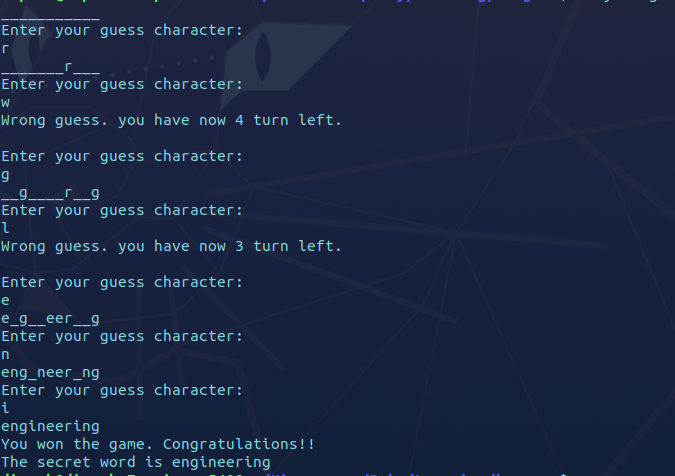

# Simple CLI Hangman game.

## Definition

Hangman is a paper and pencil guessing game for two or more players. One player thinks of a word, phrase or sentence and the other(s) tries to guess it by suggesting letters within a certain number of guesses.

## About the Project

In this project I have implemented Hangman game with Ruby where user have to guess the secret word with 5 tries.

Below contains the gameplay snapshot.

## Built With

- Ruby

## Live Demo

[Live Demo Link](https://repl.it/@dipbazz/hangman#hangman.rb)

## Getting Started

**To get a local copy up and running follow these simple example steps.**

   - Clone this repo.
   - Navigate to the hangman folder
   - In your terminal run `ruby hangman.rb`
   - You are successful to get a local copy up and running.

## Authors

👤 **Dipesh Bajgain**

- GitHub: [@dipbazz](https://github.com/dipbazz)
- Twitter: [@dipbazz](https://twitter.com/dipbazz)
- LinkedIn: [Dipesh Bajgain](https://www.linkedin.com/in/dipbazz/)

## 🤝 Contributing

Contributions, issues, and feature requests are welcome!

## Show your support

Give a ⭐️ if you like this project!

## 📝 License

This project is [MIT](./LICENSE) licensed.
